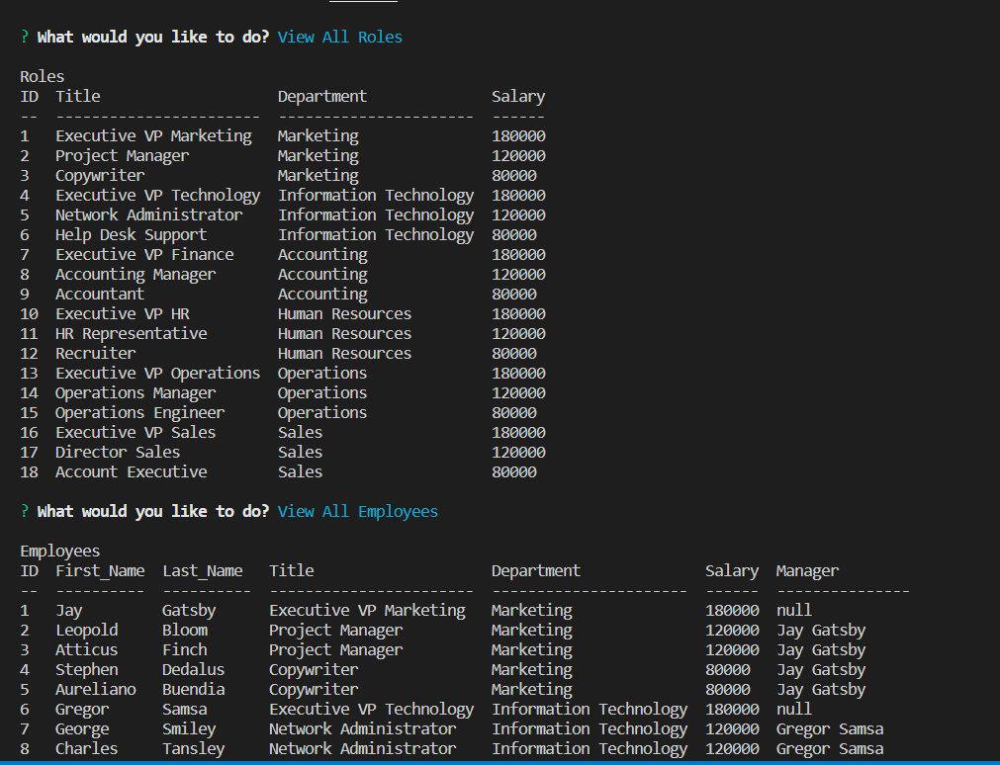

# Content Management System

## Description

Many companies struggle with managing databases that hold their employee information. This project was designed to provide a simple and easy-to-use content management system in a CLI. This will make organizing not only the employees, but the roles they play, and the corporate structure easy as well. 

This CLI is designed in a way that allows a company to easily add features in the future as well, as adding fucntions that alter the database is simple, and helps streamline the code that controls the user's prompts. All you need to do is write the new function, import it into the index.js file and add a prompt in the inquirer code. 

## Installation

The program can be run from the command line with "node index.js".

## Usage

Follow the prompts on the screen to view and alter your database. 'Quit' will end the program. 

All of the 'View' options will list the entries in the database. The 'Add' options will add the type of data you choose and then display the updated table. 'Update' functions behave this same way. 

https://github.com/brian-wastle/Content-Management-System

## Features

View All Departments
View All Roles
View All Employees
View All Direct Reports
View All Budgets
Add A Department
Add a Role
Add an Employee
Update an Employee Role

